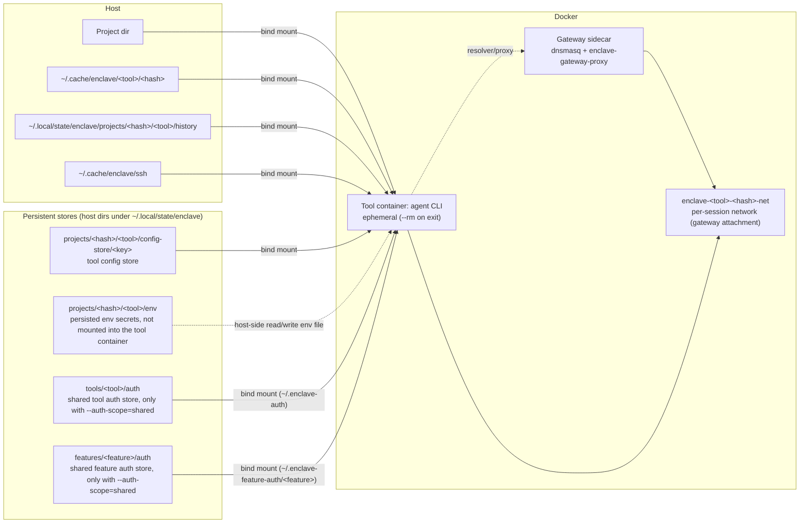
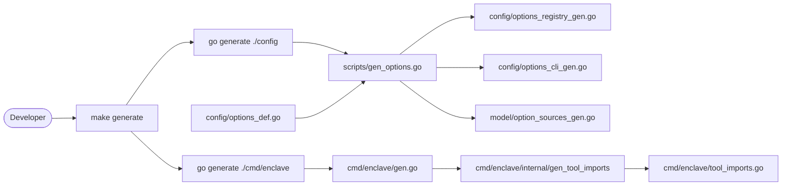

# Architecture

Enclave is a sandboxing CLI that bootstraps isolated agent tooling in Docker containers by default, with an experimental QEMU microVM backend for a narrow foreground run path, while persisting only the data you choose (host-directory stores, caches, history). The Go code is organized under `internal/` as small, focused packages with a thin CLI entrypoint in `cmd/`.

## High-Level Flow

1. Parse CLI arguments and resolve the active tool profile.
   If help is requested, render Cobra help output and exit without dispatch.
2. Discover repository assets (Dockerfiles, runtime assets, profiles).
3. Ensure the runtime image is up to date (default or derived); rebuild if needed.
   Rebuild detection hashes the rendered Dockerfile and entrypoint plus build config
   (target, base image/devcontainer, features, agent tools). A side-effect-free
   agent update planner also runs before the rebuild gate. When the interval has
   elapsed, tools with `check-update.sh` are probed in a controlled container;
   only changed fingerprints request an automatic rebuild. Agent update stamps
   and fingerprints are committed only after a successful build, and per-tool
   stages scope cache invalidation to the updated tool. `--no-rebuild` skips
   runtime and gateway image builds entirely and uses existing local images or
   fails if they are missing (use it for offline/frozen inputs).
4. Prepare mounts, persistent stores, auth, and network isolation.
5. Run the tool or shell inside an ephemeral container.

## Diagrams

### Docker runtime



### Go code generation



The restricted network request flow has a separate
[sequence diagram](runtime/network-request-flow.md).

## Repository Layout

### Entry Points
- [`cmd/enclave/main.go`](../cmd/enclave/main.go) is the binary entrypoint. It delegates to `app.Run`.
- [`cmd/enclave-gateway-proxy/main.go`](../cmd/enclave-gateway-proxy/main.go) is the gateway sidecar MITM proxy entrypoint used by `Dockerfile.gateway`.

### Orchestration (`internal/app/`)
- [`internal/app/app.go`](../internal/app/app.go) wires parsing, defaults merging, and command dispatch.
- [`internal/app/commands.go`](../internal/app/commands.go) routes commands to handlers (run/continue/resume/exec/shell/cleanup/tools/etc).
- [`internal/app/command_run.go`](../internal/app/command_run.go) drives the run/continue/resume/exec/shell flow and runtime creation.
- [`internal/app/build.go`](../internal/app/build.go) manages Docker image build/rebuild detection plus prebuild agent update planning and post-build stamp commits.
- [`internal/app/cleanup.go`](../internal/app/cleanup.go) implements `enclave cleanup` (persistent stores, caches, history, and agent memory).
- [`internal/app/ssh.go`](../internal/app/ssh.go) implements `enclave ssh-init`.
- [`internal/app/tools.go`](../internal/app/tools.go) lists available tool profiles.
- [`internal/app/network_cmd.go`](../internal/app/network_cmd.go) implements `enclave network` subcommands (status, print, diff, apply, add-domain, remove-domain, set-mode).
- [`internal/cli/network_command.go`](../internal/cli/network_command.go) defines Cobra command structure and flag parsing for the `network` subcommand tree.

### Configuration and Profiles
- [`extensions/tools/`](../extensions/tools/) contains per-tool configuration (`spec.yaml`, templates, allowlists, install scripts, optional `check-update.sh` hooks).
- [`internal/config/paths.go`](../internal/config/paths.go) discovers `Dockerfile`, `entrypoint.sh`, extensions, and runtime assets.
- [`internal/config/profile.go`](../internal/config/profile.go) loads and lists tool profiles from extension directories.
- [`internal/domainpattern/pattern.go`](../internal/domainpattern/pattern.go) validates and normalizes strict domain patterns used by secret release host mappings.

### Runtime Execution
- [`internal/runtime/runtime.go`](../internal/runtime/runtime.go) coordinates mounts, persistent stores, auth injection, network isolation, and container execution through the selected isolation backend.
- [`internal/backend/`](../internal/backend/) defines the backend-neutral session/lifecycle contract, request types, capability validation, and storage API. [`internal/backend/docker/`](../internal/backend/docker/) implements that contract on top of Docker; [`internal/backend/qemu/`](../internal/backend/qemu/) implements the experimental QEMU foreground backend.
- [`internal/runtime/auth_manager.go`](../internal/runtime/auth_manager.go), [`internal/runtime/volume_manager.go`](../internal/runtime/volume_manager.go), [`internal/runtime/network_manager.go`](../internal/runtime/network_manager.go), [`internal/runtime/command_builder.go`](../internal/runtime/command_builder.go) encapsulate focused runtime concerns.
- [`internal/runtime/secret_mapping.go`](../internal/runtime/secret_mapping.go) defines `SecretMapping` and the gateway wire entries that carry placeholder→secret release rules from auth preparation to the gateway.
- [`internal/mounts/mounts.go`](../internal/mounts/mounts.go) validates mount paths, worktree support, and port mapping.
- [`internal/auth/auth.go`](../internal/auth/auth.go) resolves layered secrets, copies auth files, and handles Claude-specific config.
- [`internal/auth/secret_injection.go`](../internal/auth/secret_injection.go) provides `PlaceholderResolver`, which generates cryptographically random `ENCLAVE_SECRET_*` placeholders for declared env secrets that use gateway-side HTTP release.
- [`internal/gateway/gateway.go`](../internal/gateway/gateway.go) manages the gateway sidecar container and network.
- [`internal/gateway/bundle/bundle.go`](../internal/gateway/bundle/bundle.go) writes host-managed gateway bundles (`dnsmasq.conf`, `domains.txt`, `meta.json`) used for runtime apply/reload.
- [`internal/gateway/mitm/`](../internal/gateway/mitm/) implements TLS MITM request forwarding, allowlist checks, and secret placeholder header rewriting/blocking.
- [`internal/gateway/tlsstore/`](../internal/gateway/tlsstore/) manages CA generation and per-host leaf certificate cache files for gateway TLS interception.
- [`internal/docker/`](../internal/docker/) wraps the Docker CLI for Docker-specific backend/build/cleanup implementation details.

### Tool Handlers
- [`internal/tools/handler.go`](../internal/tools/handler.go) defines handler hooks used by runtime.
- [`extensions/tools/<tool>/go/handler.go`](../extensions/tools/) registers per-tool behavior (ports and validation hooks).

### Network Policy
- [`internal/network/`](../internal/network/) implements network policy loading and merging for the `network.jsonc` configuration format. Handles dnsmasq config generation, JSONC parsing, and policy merge logic.
- [`internal/policy/effective_resolver.go`](../internal/policy/effective_resolver.go) centralizes effective-policy resolution for startup, network status, and runtime apply.
- [`internal/app/network_helpers.go`](../internal/app/network_helpers.go) discovers running gateways, verifies bundle mounts, hashes desired/running bundles, and confirms reload outcomes.

### DevContainer Support
- [`internal/devcontainer/`](../internal/devcontainer/) generates `devcontainer.json` configurations for devcontainer mode.

### Shared Types and Utilities
- [`internal/model/types.go`](../internal/model/types.go) defines core types and constants used across packages.
- [`internal/util/util.go`](../internal/util/util.go) provides hashing, path checks, and string helpers.
- [`internal/logx/logx.go`](../internal/logx/logx.go) provides structured logging with color output and a debug level.
- [`internal/usercmd/usercmd.go`](../internal/usercmd/usercmd.go) discovers user-defined subcommands dropped into `~/.config/enclave/commands/{host,session}/` (executable files become `enclave <name>` verbs). Discovered names are intercepted in `cli.Parse` before Cobra/`normalizeArgs` (see the User-defined subcommands concept below); built-ins always win.

### Container Assets
- [`Dockerfile`](../Dockerfile) builds the runtime image with a split build graph (`tool-base` -> `feature-base` -> `standard`) plus generated per-tool stages. Runtime image build contexts and structural rebuild hashes are scoped to the selected tools/features for the current image variant.
- [`Dockerfile.gateway`](../Dockerfile.gateway) builds the gateway sidecar image (DNS + transparent proxy + MITM rewrite proxy binary).
- [`gateway-entrypoint.sh`](../gateway-entrypoint.sh) runs a supervisor that validates bundles, starts dnsmasq/proxy, handles SIGHUP reloads, and fails closed on reload/process errors.
- [`entrypoint.sh`](../entrypoint.sh) performs in-container setup (auth symlinks, settings seeding, telemetry defaults, direnv, gitconfig).
- [`runtime-assets/gateway-allowlists/`](../runtime-assets/gateway-allowlists/) holds base DNS allowlists and domain fragments baked into the image.
- [`runtime-assets/build-scripts/`](../runtime-assets/build-scripts/) holds Docker build composition scripts (feature selection/install, template aggregation, agent tool helper setup).
- [`runtime-assets/auth-reconcile.sh`](../runtime-assets/auth-reconcile.sh) holds shared shell logic used by the entrypoint and helper containers to reconcile shared auth files.
- [`runtime-assets/net.sh`](../runtime-assets/net.sh) holds shared entrypoint network helpers (local resolver and loopback proxy setup).
- [`runtime-assets/microvm/alpine/`](../runtime-assets/microvm/alpine/) holds the experimental QEMU Alpine bundle init and builder.
- [`extensions/tools/<tool>/templates/`](../extensions/tools/) holds per-tool settings templates baked into the image during build.

## Key Concepts

- **Profiles** (`extensions/tools/<tool>/spec.yaml`, `kind: sandbox`): define tool command, session continuation args (`continueArgs`, `resumeArgs`), config location, optional settings/skills metadata (`settingsFile`, `settingsTarget`, `skillsDir`), optional host passthrough allow-list (`passthroughPaths`), optional QEMU bundle minimum memory (`qemuMinMemoryMiB`) and config-store cache hint (`qemuStoreCacheMmap`), declared credential sources (`credentials.sources`) including API-key metadata, YOLO flag, and per-provider auth configuration (`providers`: credentials, auth files, auth session checks, OAuth ports).
- **Runtime assets** (`runtime-assets/gateway-allowlists/`, `runtime-assets/build-scripts/`, `runtime-assets/auth-reconcile.sh`, `runtime-assets/net.sh`): DNS allowlists, Docker weaving scripts, and shared entrypoint helpers baked into the image. Tool templates live in `extensions/tools/<tool>/templates/` and are aggregated during build.
- **Image selection**: images are per-tool. The default tag is `enclave-<tool>:latest` for the selected `--tool` (default `claude`); `--slim` uses `enclave-<tool>:slim`. When running from a git checkout on a non-default branch, the tag is prefixed with the branch name and hash (for example, `enclave-codex:branch-<name>-<hash>-latest`) to avoid overwriting main images. `--base-image` or devcontainer mode derives a separate tag (e.g., `enclave-codex:base-<hash>-latest`) unless `--image-name` is set.
- **Agent Node isolation**: Node-based agent CLIs are installed with a private runtime at `/opt/enclave/node` and launcher shebangs are rewritten to that absolute node path. This keeps agent runtime Node independent from user/project `node` on PATH.
- **Isolation backend**: `--backend` selects the session isolation backend. `docker` is the default and supports the full feature set. Experimental `qemu` supports foreground slim/no-feature unrestricted sessions in an Alpine microVM bundle. Both backends realize persistent stores from the shared host-directory layout (`internal/backend/hoststore`), so auth, tool config, and persisted env are shared between containers and microVMs.
- **User-defined subcommands**: executables under `~/.config/enclave/commands/{host,session}/` become `enclave <name>` verbs. `cli.Parse` discovers them, registers name-only stub commands (Cobra group "User Commands") so they list in `--help` and shell completion, and intercepts a matching first positional *before* `normalizeArgs`/Cobra so the trailing line reaches the script verbatim (preserving the unknown-command rejection for everything else). enclave flags must precede the name: host commands accept only the global group, session commands accept the full session flag set. `host/` commands exec directly on the host (`os/exec`, exit code/stdin/stdout passthrough, `ENCLAVE_BIN`/`ENCLAVE_PROJECT_ROOT`/`ENCLAVE_CONFIG_DIR` injected). `session/` commands run through the normal run pipeline as a shell-style execution (`opts.Shell=true`, argv `bash -c 'exec "$@"' <name> <container-path> <args>` so the script's shebang is honored via execve).
- **Session command isolation boundary**: session commands mount only the `session/` tree, read-only, at the fixed neutral container path `/opt/enclave/commands` (`model.UserCommandsContainerDir`) via a dedicated `model.UserCommandMount` — never through `mounts.AddAdditional` (which mirrors host paths and would leak the home layout). No mount/backend code path ever references the `host/` tree, and no enclave host-data directory is otherwise mounted, so host commands stay invisible in-container by construction. Session commands receive no `ENCLAVE_*` env injection.
- **Detached sessions**: `--background` runs detached tool containers that can be reattached. There is no separate daemon run mode.
- **Persistent stores**: per-tool/project stores hold tool configs; an optional env store persists env auth and `--pass-env` values when persistence is enabled (default unless `--ephemeral`). Stores are host directories under `~/.local/state/enclave/` bind-mounted into the container (no Docker volumes). See [`docs/runtime/stores.md`](runtime/stores.md) for detailed store lifecycle, auth symlinks, and scoping documentation.
- **Caches/history**: host-side caches are stored under `~/.cache/enclave/` and shell history under `~/.local/state/enclave/projects/`.
- **Network isolation**: by default, a gateway sidecar (dnsmasq + transparent proxy) restricts outbound domains. DNS blocks unknown domains, and the proxy is passthrough-by-default with MITM only for hosts that need secret release rewriting unless `network_log=requests` forces MITM for all allowlisted HTTPS.
- **Declared secrets and HTTP release**: tool profiles and enabled feature manifests can declare `secrets`. Each secret lists env-var aliases and can optionally define `release.http` target hosts/header formatting. Declared secrets are resolved from host env, layered secrets files, or persisted env; when gateway release is enabled, matching secrets are replaced with `ENCLAVE_SECRET_*` placeholders inside the container. The flow is: extension `secrets` config → `PlaceholderResolver` generates placeholders → `SecretMapping` entries written to a JSON file → gateway proxy loads secret release rules and performs header rewriting on HTTPS requests. Plaintext HTTP requests carrying placeholders are denied. This protection is limited to env-var injection: credential files written by auth hooks can still contain the real secret in the config/auth store.
- **Gateway audit events**: the MITM proxy emits JSONL network events to the host-mounted network log path (`~/.local/state/enclave/projects/<hash>/<tool>/logs/network.log`). Default `network_log=coarse` records pass/deny decisions for HTTP and TLS dispatch; `network_log=requests` adds request-level HTTP/HTTPS audit events by forcing allowlisted HTTPS through MITM.
- **Gateway container labels**: gateway containers are tagged with Docker labels (`enclave.gateway`, `enclave.agent`, `enclave.gateway.project_hash`, etc.) for runtime discovery by `network status` and `network apply`.
- **Live policy reload**: the `enclave network apply` command writes an updated config bundle to the host, signals the gateway with SIGHUP, and polls logs for reload confirmation. The gateway supervisor validates the new bundle before swapping, with fail-closed semantics on error.

## Containers and Stores

### Containers

- **Tool container**: the primary ephemeral container launched for the tool or shell. It mounts the project directory read-write by default, or read-only when `project_mount=readonly` / `--project-mount readonly` is set. Linked worktree git metadata mounts follow the same mode by default; `worktree_metadata=readonly|none` forces them read-only or skips them independently of the project mount. Devcontainer-derived project bind mounts are forced read-only in readonly mode, and writable `add_dirs` entries inside the project subtree are clamped to read-only. Additional directories outside the project, caches, and history are mounted according to their own options. The container is removed on exit (`--rm`).
- **Gateway sidecar**: when network isolation is enabled, a per-project gateway container is started on a dedicated network. The tool container joins that network, uses the gateway as its resolver, and has outbound access enforced by the proxy (Host/SNI). Host policy resolution writes `~/.local/state/enclave/projects/<hash>/<tool>/gateway-config/`, and runtime apply sends `SIGHUP` so the gateway supervisor reloads dnsmasq/proxy with fail-closed semantics.

### Persistent stores

Persistent stores are host directories under `~/.local/state/enclave/` (honoring `$XDG_STATE_HOME`), bind-mounted into the container. There are no Docker volumes; store paths are derived from tool + project hash:

- **Tool config store**: `~/.local/state/enclave/projects/<hash>/<tool>/config-store/<key>/` stores the tool’s config directory (for example, `.claude` or `.codex`). `<key>` is `default` for the persistent store; `--ephemeral` uses a unique suffixed key and leaves the `default` store untouched.
- **Env store**: `~/.local/state/enclave/projects/<hash>/<tool>/env/` stores persisted env auth data and additional `--pass-env` values when persistence is enabled (default unless `--ephemeral`).
- **Shared auth store** (when `--auth-scope=shared`): `~/.local/state/enclave/tools/<tool>/auth/<identity>/` stores OAuth files shared across projects for the tool; `<identity>` is `default` or the `--auth-name` slug.
- **Feature auth store** (when `--auth-scope=shared` and feature defines `authFiles`): `~/.local/state/enclave/features/<feature>/auth/` stores feature auth files shared across tools/projects (for example `github-cli`).

Other host-side data:

- **QEMU stores**: the experimental QEMU backend mounts the same host-directory stores as the Docker backend (resolved via `internal/backend/hoststore`) into the guest over 9p, so auth, config, and env state are shared across backends.
- **QEMU bundles**: generated microVM bundles live under `${XDG_CACHE_HOME:-~/.cache}/enclave/microvm/<tool>/<hash>/` unless `--image-name` points at an explicit bundle directory.
- **Caches**: `~/.cache/enclave/<tool>/<hash>/` for package managers and build tools:
  - `npm/` - npm package cache
  - `pip/` - pip package cache
  - `go/` - Go module cache (GOMODCACHE)
  - `go-build/` - Go build cache
  - `cargo/` - Rust/Cargo cache
  - `pnpm/` - pnpm store
  - `uv/` - uv (Python) cache
  - `yarn/` - Yarn cache
  - `bun/` - Bun cache
- **History**: `~/.local/state/enclave/projects/<hash>/<tool>/history/` for shell history.
- **Agent memory**: `~/.local/state/enclave/projects/<hash>/<tool>/memory/` for per-project, agent-writable memory (Claude and Gemini only). Bind-mounted into each harness's native memory path (writable), never shared between projects or agents, disabled with `--no-memory`, and skipped for ephemeral (`--ephemeral`) sessions.
- **Home config files**: `~/.local/state/enclave/projects/<hash>/<tool>/home-config/` for host-home files created in the container:
  - `npmrc` → `~/.npmrc`
  - `yarnrc` → `~/.yarnrc`
  - `yarnrc.yml` → `~/.yarnrc.yml`
  - `bunfig.toml` → `~/.bunfig.toml`
  - `node_repl_history` → `~/.node_repl_history`
- **Tool config overrides** (user-edited, config root, keyed by project hash and outside the worktree):
  - Global overrides: `~/.config/enclave/tools/<tool>/`
  - Project overrides: `~/.config/enclave/projects/<hash>/<tool>/config/`
- **Managed skills**:
  - Shared sources: `~/.config/enclave/skills/<skill>/` globally and `~/.config/enclave/projects/<hash>/skills/<skill>/` per project.
  - Tool-specific sources mirror `skillsDir` relative to `configDir` under `~/.config/enclave/tools/<tool>/` and `~/.config/enclave/projects/<hash>/<tool>/config/`.
  - Precedence is built-in extension, user extension, host passthrough, global shared, global tool-specific, project shared, project tool-specific. Same-named skills replace complete directories.
  - Shared `SKILL.md` files are restricted to portable Agent Skills frontmatter; invalid shared skills warn and are skipped. Tools without `skillsDir` are unaffected.
  - When the config-source path handles skills, sources are composed into `config-generated/<key>/<relative skills dir>`; otherwise the fallback separate mount materializes `~/.local/state/enclave/projects/<hash>/<tool>/skills-generated/`.
- **Config patches**: global JSON/TOML patches mirror native config paths under `~/.config/enclave/patches/<tool>/`; project patches use `~/.config/enclave/projects/<hash>/patches/<tool>/`. Each patch merges an existing lower-precedence target in the generated config source.
- **Generated config source**: `~/.local/state/enclave/projects/<hash>/<tool>/config-generated/<key>/`, where `<key>` is `default` or a session/worktree-specific suffix when the writable config store is isolated. Startup builds this tree from built-in settings/templates, optional allow-listed host config (`--host-config=passthrough` + resolved `host_config_paths`), managed skills, canonical global/project config overrides, and global/project config patches, then overlays it into the writable tool config store before auth symlinks and tool setup run.

The cleanup command in [`internal/app/cleanup.go`](../internal/app/cleanup.go) can remove stores and host-side data for a single tool/project or across all projects.

## Extension Points

- Add new tools by following [`docs/extensions/adding-a-tool.md`](extensions/adding-a-tool.md) and [`docs/extensions/README.md`](extensions/README.md). Create an extension directory under `extensions/tools/<tool>/` with a `spec.yaml`, `install.sh`, and `gateway-allowlist.conf`. Add `check-update.sh` when the tool should participate in automatic update probes.
- Add DNS rules by editing [`runtime-assets/gateway-allowlists/`](../runtime-assets/gateway-allowlists/) or by using host overrides (`~/.config/enclave/gateway-allowlists/<tool>.conf` and the project-scoped `~/.config/enclave/projects/<hash>/gateway-allowlists/<tool>.conf`).
- Add templates for new CLIs in `extensions/tools/<tool>/templates/`. They are aggregated into the image during build.
- Canonical full config overrides live under `~/.config/enclave/tools/<tool>/` and project-scoped `~/.config/enclave/projects/<hash>/<tool>/config/`. Generic JSON/TOML patches use the global/project patch trees described above. Resolution layers built-in config, host passthrough, global full-or-patch, then project full-or-patch; a patch merges the complete lower-precedence result, and a same-path, same-scope full file plus patch is an error.
- Shared managed skills live under `~/.config/enclave/skills/<skill>/` and `~/.config/enclave/projects/<hash>/skills/<skill>/`; tool-specific skills use the canonical config roots at the native `skillsDir` path. See [Configuration](configuration.md#managed-skills) for precedence and portability rules.

## Option Resolution Flow

The complete flow from CLI arguments to final options:

```
┌─────────────────────────────────────────────────────────────────────────────┐
│                            app.Run(args)                                     │
│                                                                             │
│  1. config.LoadDefaults(projectDir)                                         │
│     ├── Read ~/.config/enclave/config.json → globalDefaults               │
│     └── Read <config-root>/projects/<hash>/config.json → projectDefaults    │
│         (project guardrails can strip blocked elevations, e.g.              │
│          allow_all_network=true)                                            │
│                                                                             │
│  2. cli.Parse(args, baseOpts)                                               │
│     ├── Match commands: run, shell, exec, cleanup, config, etc.             │
│     ├── Match flags via CLIFlagIndex() registry (generated), including      │
│     │   generated run options such as --backend, --host-config, --add-dir, │
│     │   --add-readonly-dir, and --project-mount                            │
│     └── Returns: Result{Options, Action, HelpShown, Sources, ConfigView}     │
│                                                                             │
│  3. model.MergeOptionSources(baseSources, cliSources)                       │
│     └── Merge source tracking (CLI wins if set)                             │
│                                                                             │
│  4. config.ApplyDefaultsWithSources(opts, globalDefaults, SourceGlobal)     │
│     └── Apply global config where CLI didn't override                       │
│                                                                             │
│  5. config.ApplyDefaultsWithSources(opts, projectDefaults, SourceProject)   │
│     └── Apply project config where global/CLI didn't override               │
│                                                                             │
│  6. Resolve tool override for selected tool                                 │
│     ├── config.ResolveToolOverrideDefaults(global, project, opts.Tool)      │
│     └── config.ApplyDefaultsWithSources(..., SourceToolOverride)            │
│                                                                             │
│  7. Final Options with Sources tracked                                      │
│     └── Each field knows: CLI, ToolOverride, Project, Global, or Default   │
└─────────────────────────────────────────────────────────────────────────────┘
```

**Precedence:** CLI > Tool override > Project config > Global config > Built-in defaults

Project guardrails are enforced while loading `~/.config/enclave/projects/<hash>/config.json`. Guarded
keys are ignored at project scope (including `tool_overrides`) with warnings,
so they cannot elevate host security defaults. For project mount hardening,
project config may set `project_mount=readonly` but cannot set
`project_mount=writable` to weaken a stricter parent default. The
`worktree_metadata` modes form the order `follow < readonly < none`; project
config may strengthen the inherited mode, but weaker values are stripped.

**Key types:**
- `model.Options` - final resolved options (embedded structs: Run, Auth, Build, Cleanup)
- `model.OptionSources` - tracks where each option came from
- `config.Defaults` - values from config files (includes `tool_overrides`)
- `config.OptionSpec` - registry defining each option's behavior (generated from `internal/config/options_def.go`)

**Source tracking:**
- `SourceDefault` - built-in default
- `SourceGlobal` - from `~/.config/enclave/config.json`
- `SourceProject` - from `~/.config/enclave/projects/<hash>/config.json`
- `SourceToolOverride` - from selected `tool_overrides.<tool>`
- `SourceCLI` - from command-line flag

The `enclave config --view source` command uses this to show where each value came from.

See [Configuration](configuration.md) for the user-facing option and source model.

## Config Defaults

Config defaults can be set in `~/.config/enclave/config.json` (global) and
`~/.config/enclave/projects/<hash>/config.json` (project; per-project
overrides are keyed by project hash and live outside the worktree). Precedence
is:

1. CLI flags
2. Selected tool override (`tool_overrides.<tool>`)
3. Project config
4. Global config
5. Built-in defaults

Guardrail note: project config cannot elevate guarded options such as
`allow_all_network=true`; those values are ignored with warnings. Host intent
must come from global config (`~/.config/enclave/config.json`) or explicit CLI flags.

`cache_from` can be used to add inline `docker build` cache sources (same as
`--cache-from`). Some build controls are intentionally CLI-only and not read
from config files, including `--rebuild`, `--no-rebuild`,
`--force-base-image`, `--build-uid`, `--build-gid`, `--runtime-uid-remap`, and
the buildx cache flags.

Runtime image hashes include the effective build UID/GID. Explicit
`--build-uid` / `--build-gid` values are used when provided; otherwise the host
UID/GID is included after host resolution. This prevents a loaded shared image
from being accepted as current when it was built for a different numeric user.

`features` can be set from config or CLI (`--features`). In devcontainer mode,
the unset default is no enclave features; pass `--features` (or configure
`features`) to opt in. `--features none` selects zero features explicitly.
Config additive entries (`+`/`-`) are applied against the implicit
default-enabled feature set when `features` is otherwise unset.

`host_config_paths` is a per-tool config option resolved against the selected
tool profile's reviewed `passthroughPaths`. Additive-only entries (`+`/`-`)
modify that built-in allow-list; bare entries replace it unless `default` is
included explicitly.

## Image Naming

Images are per-tool; `<tool>` below is the selected `--tool` (default `claude`).
Default image naming behavior:

- Explicit `--image-name`: always used (no auto-derivation).
- Default build: `enclave-<tool>:latest` (or `enclave-<tool>:branch-<name>-<hash>-latest` on non-default git branches)
- `--slim`: `enclave-<tool>:slim`
- `--base-image` or devcontainer mode without `--image-name`:
  - `enclave-<tool>:base-<hash>-latest` or `enclave-<tool>:devcontainer-<hash>-latest`
  - slim: `enclave-<tool>:base-<hash>-slim` or `enclave-<tool>:devcontainer-<hash>-slim`
