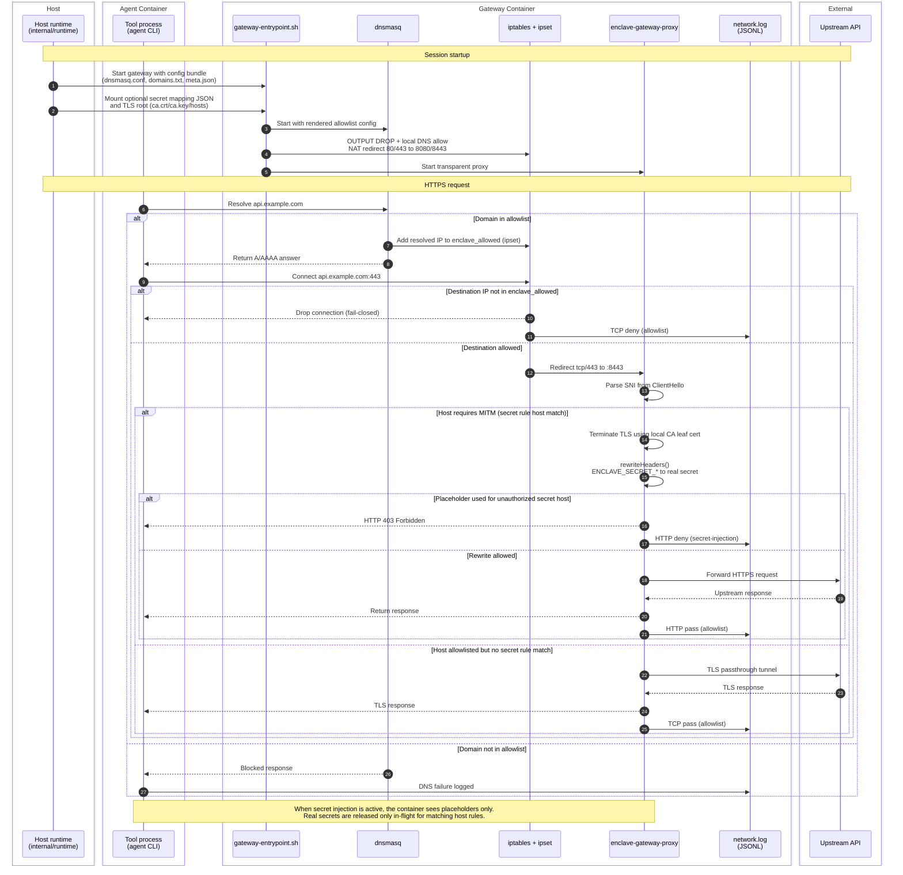

# Network Request Flow

This document describes how enclave handles outbound network requests in restricted mode, including DNS policy enforcement, proxying, and secret placeholder rewriting.

## Diagram

## Flow Summary

1. The host runtime writes a gateway config bundle (`dnsmasq.conf`, `domains.txt`, `meta.json`) and starts the sidecar.
2. `gateway-entrypoint.sh` applies a fail-closed firewall (`OUTPUT DROP`), starts `dnsmasq`, and redirects outbound `tcp/80` and `tcp/443` to `enclave-gateway-proxy`.
3. DNS resolution goes through `dnsmasq`. Allowlisted domains resolve and populate the `enclave_allowed` `ipset`; non-allowlisted domains fail resolution.
4. TCP connections are gated by firewall rules and redirected to the proxy. The proxy checks host allowlist rules again using HTTP `Host` / TLS `SNI`.
5. For hosts that match declared secret `release.http` rules, or for all allowlisted HTTPS when `network_log=requests`, the proxy uses TLS MITM before forwarding upstream.
6. If a placeholder appears on plaintext HTTP or on a host outside that secret rule's `hosts`, the proxy blocks the request with HTTP 403.
7. `network_log=coarse` writes pass/deny events to `~/.local/state/enclave/projects/<hash>/<tool>/logs/network.log`; `network_log=requests` adds request-level HTTP/HTTPS audit events.

## Why This Works

- Real API key values for mapped secrets are never exposed inside the tool container environment.
- Egress checks happen at multiple layers (DNS allowlist, firewall/IP set, proxy host checks).
- Gateway reload/startup failures fail closed rather than silently allowing unrestricted egress.
- Host-side network logs preserve an auditable record of pass/deny decisions.

## Scope and Limits

- In unrestricted mode (`--allow-all-network` or policy mode `unrestricted`), the gateway is bypassed and HTTP secret release is disabled.
- `--network-log=requests` enables request-level MITM logging in restricted mode.
- Placeholder protection applies only to declared secrets with `release.http` in the selected tool profile or enabled feature manifests.
- Real secrets are released only on HTTPS requests; plaintext HTTP requests carrying a placeholder are denied.
- Current secret injection is header-based; file credential mediation is separate work.

## Related Implementation

- [`internal/runtime/network_manager.go`](../../internal/runtime/network_manager.go)
- [`internal/runtime/auth_manager.go`](../../internal/runtime/auth_manager.go)
- [`internal/gateway/bundle/bundle.go`](../../internal/gateway/bundle/bundle.go)
- [`internal/gateway/mitm/proxy.go`](../../internal/gateway/mitm/proxy.go)
- [`gateway-entrypoint.sh`](../../gateway-entrypoint.sh)
