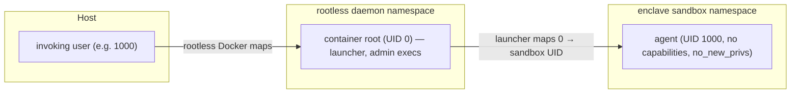

# Rootless Docker compatibility

**Status: supported.** Enclave detects a rootless daemon from `docker info` and
launches sessions through a nested user-namespace sandbox. No flags are
required, and the agent runs at a normal nonzero UID/GID.

## The mapping problem

A rootless daemon confines containers to a user namespace that maps the
invoking host user to container UID 0 and container UID *N* (N > 0) to the
subordinate host UID `subuid_base + N - 1`. Two consequences follow for a
sandbox built on bind mounts:

- a container process can only own host-user files **as container UID 0**, and
- files created by container UID *N* land on the host owned by a subordinate
  UID the invoking user cannot even read.

Docker offers no per-container remapping (no idmapped bind mounts, no podman
`--userns=keep-id` equivalent), and agents must not run with effective UID 0 —
plenty of tooling special-cases root. Enclave therefore adds the missing
mapping level itself. (Podman does have `--userns=keep-id`, which is why
rootless sessions under `--backend podman` need none of this machinery; see
[Rootless Podman](#rootless-podman) below.)

## The nested-namespace sandbox

On a rootless daemon the session container starts as container root (which *is*
the unprivileged invoking user) and the entrypoint forks the session into a
child user namespace:

- The **outer phase** (container root) rewrites the agent's passwd/group entry
  to the sandbox identity, protects `/` and the sandbox pid file by chowning
  them to an outer UID that is unmapped inside, then forks
  `unshare --user --mount --propagation private --map-user=<uid>
  --map-group=<gid> --keep-caps` and supervises the child (signal forwarding,
  exit-status propagation).
- The **inner phase** still holds capabilities inside the child namespace: it
  bind-remounts the system paths (`/usr`, `/etc`, `/opt`, `/var`, `/srv`,
  `/root`, ...) read-only — the agent owns them in the mapped view, so
  mount-level read-only is the enforcement — then drops every capability
  (ambient and bounding) and enables `no_new_privs` before continuing as the
  agent. Because a bind remount only affects the mount it names, each
  pre-existing submount under those roots is sealed individually: Docker
  bind-mounts `/etc/resolv.conf`, `/etc/hosts`, and `/etc/hostname` as separate
  mounts, and leaving them writable would let the agent repoint DNS and bypass
  domain enforcement. Sealing fails closed.
- **Execs** (`enclave shell` into a running session, status capture) are routed
  through `enclave-sandbox-exec`, which joins the sandbox via
  `nsenter --target <pid> --user --mount` and drops to the sandbox identity.
  `--admin` execs intentionally stay in the outer namespace: that is the
  rootless equivalent of a privileged shell, where the system paths are
  writable (e.g. `apt-get install`; the sandbox sees installed packages
  immediately through the same underlying filesystem).

The result satisfies the identity requirements exactly:

| Property | Behavior |
| --- | --- |
| Agent identity | nonzero UID/GID (the host user's IDs), `CapEff=0`, `no_new_privs` |
| Host-owned `0644`/`0755` worktrees | writable; owned by the agent in the mapped view |
| Files created by the agent | owned on the host by the invoking user |
| Git | ownership matches; no `safe.directory` workaround |
| Container system paths | read-only for the agent |

Because the sandbox maps outer UID 0 to the agent, the **image is built with
the agent user as a UID 0 alias** under rootless (`USER_ID=0` build arg): its
files must be host-user-owned for the mapping to hand them to the agent. The
effective build identity is part of the image hash, so rootful and rootless
setups build distinct images and switching daemons rebuilds instead of reusing
a mismatched image. `--build-uid`/`--build-gid` still override detection.

## Seccomp profile

Docker's default seccomp profile blocks user-namespace creation without
`CAP_SYS_ADMIN`, so Enclave runs rootless sessions with an embedded derivative
of the Moby default profile (`internal/backend/docker/seccomp/`) that
additionally allows:

- `unshare`, argument-filtered to `CLONE_NEWUSER|CLONE_NEWNS`;
- the mount syscall family and `setns`, which the kernel still gates on
  `CAP_SYS_ADMIN` in the owning user namespace — only the launcher's child
  namespace grants that, and only over its own mounts.

No capabilities are added, no devices are exposed, and `--privileged`,
`seccomp=unconfined`, and AppArmor changes are not used. The tool container
keeps the standard hardening (`no-new-privileges`, sudoers neutralized). A
side effect matching stock Linux (and intentionally accepted): the agent may
create user namespaces of its own, in which it holds capabilities only over
resources it already owns — the same default any unprivileged host process has.

## Network isolation

Unchanged, and enforced fail-closed. Because the sandbox seals `/etc`, the
launcher points `/etc/resolv.conf` at the gateway's dnsmasq in the outer phase
and verifies it took effect; a restricted session whose resolver cannot be set
aborts rather than falling back to the daemon resolver.

The gateway container runs with `NET_ADMIN`/`NET_RAW` inside the
rootless namespace — iptables, ipset, and the dnsmasq/proxy redirect all work
against the daemon's kernel view — and the tool container shares its network
namespace without those capabilities. In-container root (outer or sandboxed)
cannot alter the filter: domain enforcement, request auditing, and
gateway-side secret release behave exactly as on a rootful daemon. Escaping a
rootless container yields the invoking user's privileges, not host root, so
the host-side blast radius is strictly smaller.

## Requirements and limitations

- The invoking user must own the rootless daemon.
- The netfilter modules the gateway needs (`ip_tables`, `ip_set`, `xt_set`,
  `xt_owner`, `nf_nat`, ...) must be available on the host kernel.
- Kernel user namespaces must be permitted. On Ubuntu 24.04+
  (`apparmor_restrict_unprivileged_userns=1`) rootless Docker's own AppArmor
  profile already covers the daemon and its containers.
- `sudo` does not work inside rootless sessions (no UID 0 exists in the
  sandbox); rootful hardened sessions already neutralize it. Use `--admin` for
  package installs.
- Devcontainer `remoteUser`/`--use-remote-user` and `--runtime-uid-remap` are
  not supported with rootless; sessions fail with a clear error.
- Publishing host ports below 1024 requires host configuration
  (`net.ipv4.ip_unprivileged_port_start`).

## Rootless Podman

**Status: supported** via `--backend podman`. Rootless Podman provides the
per-container remapping Docker lacks, so none of the nested-sandbox machinery
above applies: no launcher phase, no custom seccomp profile, no UID 0 alias in
the image. Sessions keep the standard hardening (`no-new-privileges`, sudoers
neutralized).

- **Unrestricted sessions** run with `--userns=keep-id`: the agent's uid *is*
  the invoking user's uid, bind-mounted worktrees keep host ownership in both
  directions, and the build identity is the host uid/gid (so podman and
  rootless-Docker image hashes differ and switching engines rebuilds).
- **Restricted sessions** hang the keep-id namespace on the gateway sidecar
  (`--userns=keep-id`, pinned to user root for iptables/dnsmasq setup); the
  tool container joins it with `--userns=container:<gateway>` alongside
  `--network container:<gateway>`. The kernel only lets a container mount
  sysfs when it shares the netns owner's user namespace, so the tool must
  join both. DNS pinning is inherited: the gateway rewrites its own
  `/etc/resolv.conf` to the local dnsmasq, and the joined tool container sees
  the same file — the agent (nonzero uid) cannot modify it.
- **Gateway host writes**: inside the keep-id namespace the gateway's root
  maps to a subordinate host uid. The network log is pre-created by the host,
  so appends preserve host ownership. Per-host TLS leaf cache files are
  created by the proxy and land subordinate-owned on the host; the host can
  still delete them (it owns the parent directory) and the gateway re-reads
  them under the same mapping.
- **`--admin`** runs as root inside the keep-id namespace: package installs
  work (the image filesystem is root-owned in that view), but files an admin
  shell creates under bind mounts land subordinate-owned on the host. Use the
  normal session identity for worktree writes.
- **Auth reconcile** helper containers also run under keep-id so chowns to
  the host uid land on the invoking user.

Rootful podman behaves like rootful Docker: the host user's uid/gid is used
as the build and runtime identity, and the same host-hardening guidance
applies.

For rootful hardening options, see [Host hardening](host-hardening.md).
